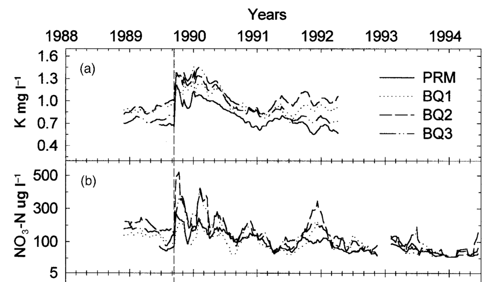
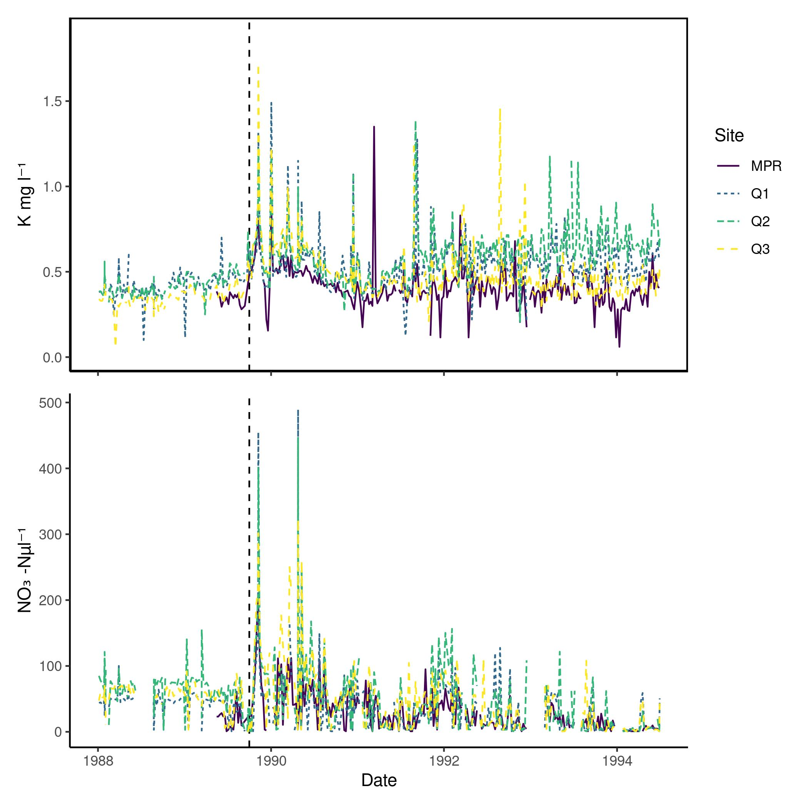
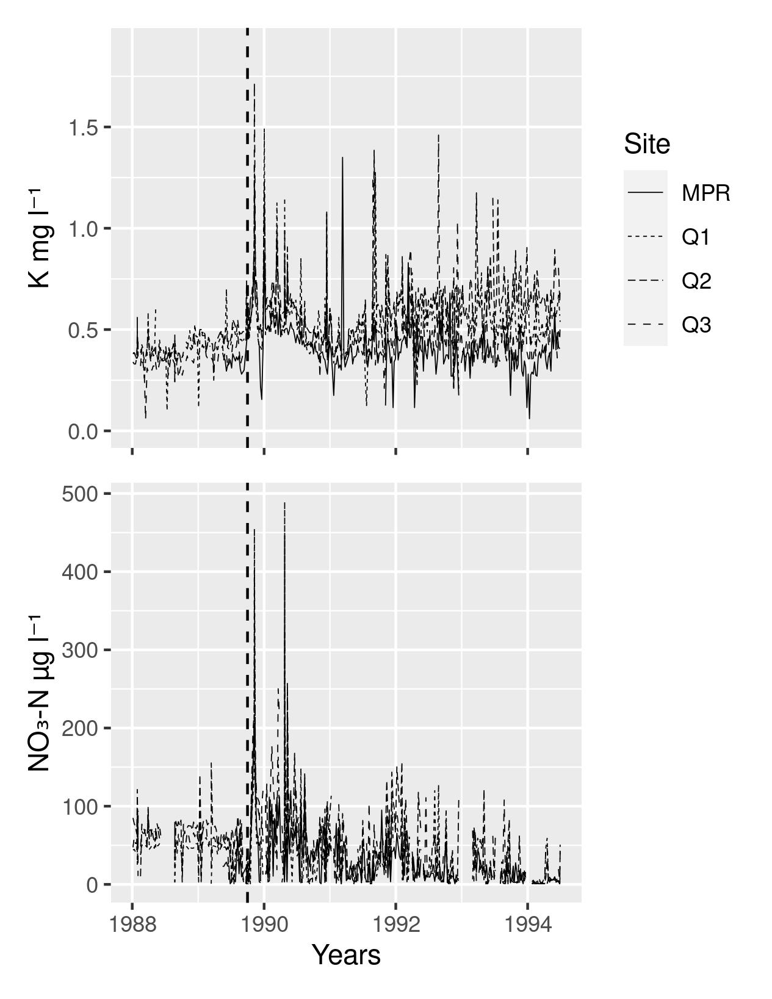
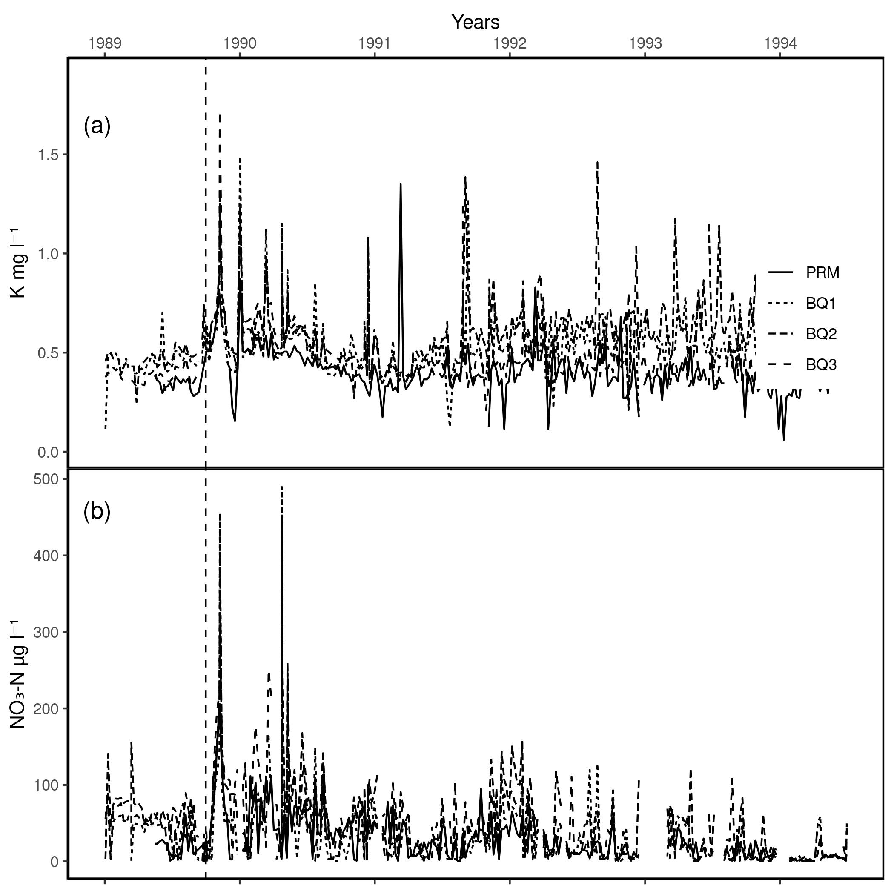

```{r setup, include=FALSE}
knitr::opts_chunk$set(echo = TRUE)
```

```{r xaringan-themer, include=FALSE, warning=FALSE}
library(xaringanthemer)
style_duo(primary_color = "#1F4257", secondary_color = "#F97B64")
```


     
---

# Goals
- **Reproduce the nitrate and potassium plot for Hurricane Hugo in Luquillo, Puerto Rico.**

- Investigate broader hurricane impact on stream chemistry data.

---

# Team Organization
**- Alex: Nimble Navigator**
  - Dove into metadata and helped with plot direction

**- Austin: Git Guru**
  - Solved merge conflicts, resurrected plots, and kept the team afloat

**- Clarissa: Code Captain**
  - Created the code and styled plots

**- Cullen: Plot Pundit**
  - Produced all custom ggplot themes and features

---

# Step 1: Project Set-Up

**- Getting the data**
  - Downloaded data from EDI Data Portal to Alex's computer
    McDowell, W. 2021. Chemistry of stream water from the Luquillo Mountains ver 4923052. Environmental Data Initiative

**- Creating a GitHub repository**
  - Created GitHub repository on Clarissa's github
  - https://github.com/cboyajian/nutria
  - Invited Alex, Cullen, and Austen to be collaborators

**- Saving the data** 
  - Upload to GitHub repository (technical issues with saving to server)
  - Switched back to server
    - File structure: nutria - docs, figs, raw-data
    - Used SCP to upload into data folder

---

# Step 1: Project Set-Up

**- Creating separate branches**
  - Merge conflicts (small project)
  - Each work on different branch (communicate verbally)

**- Creating presentation outline using pair programming**
  - Driver: Austin
    - Added notes to presentation file
  - Navigators: Alex, Cullen Clarissa
    - Slide assignments
    - General overview of presentation content

**- Creating presentation using GitHub branches**
  - Each created own branch from outline
  - Merged together and added final updates

---


# Step 2: Load libraries

We knew we'd need the standard libraries we've been working with for data wrangling and plotting. We started with tidyverse, here, and janitor.
```{r, results='hide', message=FALSE}
library(tidyverse)
library(here)
library(janitor)
```

Later on in the data wrangling process, we realized we would need a few additional packages. `lubridate` facilitated the use of date data, and we used `patchwork` to compile faceted graphs.
```{r, results='hide', message=FALSE}
library(lubridate)
library(patchwork)
```

---

# Step 3: Reading & Munging the Data 

```{r, results='hide', message=FALSE}
# Listing what data files are available
list.files(path = "/courses/EDS214/nutria/raw-data")
```

---

# Reading Data for Plot 1

```{r}
# Watershed 1
bq1 <- read_csv(
  here("raw-data", "QuebradaCuenca1-Bisley.csv"),
  na = c("-9999", "-9999.00"), show_col_types = FALSE)

bq2 <- read_csv( #<<
  here("raw-data", "QuebradaCuenca2-Bisley.csv"), #<<
  na = c("-9999", "-9999.00"), show_col_types = FALSE) %>% #<<
  separate(col = Sample_Date, #<<
         into = c("Sample_Date", "time"), #<<
          sep = " ") %>% #<<
  select(-time) #<<

bq3 <- read_csv(
  here("raw-data", "QuebradaCuenca3-Bisley.csv"), 
  na = c("-9999", "-9999.00"), show_col_types = FALSE)

prm <- read_csv(
  here("raw-data", "RioMameyesPuenteRoto.csv"), 
  na = c("-9999", "-9999.00"), show_col_types = FALSE)
```

---

# Munging Plot 1 Data

```{r}
stream_data <- rbind(bq1, bq2, bq3, prm) %>% 
  clean_names() %>% 
  select(sample_id, sample_date, no3, k) %>% 
  mutate(
    sample_date = mdy(sample_date),
    sample_id = case_when(
      sample_id == "MPR" ~ "PRM",
      sample_id == "Q1" ~ "BQ1",
      sample_id == "Q2" ~ "BQ2",
      sample_id == "Q3" ~ "BQ3"),
    sample_id = factor(
      sample_id, 
      levels = c("PRM", "BQ1", "BQ2", "BQ3")))
```

---

# Munging Plot 2 Data

```{r include=FALSE}
# Watershed 2
qpb <- read_csv(here("raw-data", "QuebradaPrieta-B.csv"), na = c("-9999", "-9999.00"))
qpa <- read_csv(here("raw-data", "QuebradaPrieta-A.csv"), na = c("-9999", "-9999.00"))
qs <- read_csv(here("raw-data", "QuebradaSonadora.csv"), na = c("-9999", "-9999.00"))
stream_data_2 <- rbind(qpb, qpa, qs) %>% 
  clean_names() %>% 
  select(sample_id, sample_date, no3, k, mg, ca, nh4_n) %>% 
  mutate(sample_date = mdy(sample_date),
         sample_id = factor(
           sample_id, level = c("QS", "QPA", "QPB")),
         k = k / 2,
         no3 = no3 / 2)
```

```{r}
stream_data_2 <- stream_data_2 %>% 
  pivot_longer(cols = 3:7, names_to = "chem", # Make Data tidy  #<<
               values_to = "concentration") %>%  #<< 
  mutate(
    chem = case_when( # Use unicode to make nice labels #<<
      chem == "k" ~ "K mg l\u207b\u00b9", #<<
      chem == "no3" ~ "NO\u2083\u2010N \u00b5g l\u207b\u00b9",
      chem == "nh4_n" ~ "NH\u2084\u2010N \u00b5g l\u207b\u00b9",
      chem == "ca" ~ "Ca mg l\u207b\u00b9",
      chem == "mg" ~ "Mg mg l\u207b\u00b9"),
    chem = factor(
      chem, levels = c( # Factor and set levels #<<
        "K mg l\u207b\u00b9",  #<<
        "NO\u2083\u2010N \u00b5g l\u207b\u00b9", 
        "Mg mg l\u207b\u00b9", 
        "Ca mg l\u207b\u00b9",
        "NH\u2084\u2010N \u00b5g l\u207b\u00b9")))
```

---

# Step 4: Creating Initial Plots

Because we were having issues with expiring git tokens, we needed to work on the initial plots individually. Alex, Clarissa, and Cullen all worked on replicating the original plots. We ended up with these three versions. Once our tokens were working again, we decided Clarissa's was best and moved forward with hers.

---

class: split-two

.column[

<br>Original
]
.column[

<br>Cullen
]

---

class: split-two

.column[

<br>Original
]
.column[

<br>Alex
]

---

class: split-two

.column[

<br>Original
]
.column[

<br>Clarissa
]

---

# The winner


---

# Step 5: Beautify-ing Plots & Pair Programming

**- Pair programming to beautify plots**
  - Driver: Clarissa
    - Practice writing out code
    
  - Navigators: Alex, Austin, Cullen
    - Removed margins between plots
    - Changed header and tick locations
    - Changed legend location (covered part of data on top plot)
    - Updated legend names and order

---

# Step 5: Beautify-ing Plots & Pair Programming  

```{r echo=FALSE, fig.width=12, fig.height=6, warning=FALSE}
plot_k_2 <- ggplot(data = stream_data, aes(x = sample_date, y = k / 2)) +
  geom_line(aes(linetype = sample_id)) +
  geom_vline(xintercept = as.Date("1989-09-10"), 
             linetype = "dashed") +
  scale_x_date(limits = c(as.Date("1989-01-01"), 
                          as.Date("1994-07-01")), 
               date_breaks = "1 year", 
               date_labels = "%Y", 
               position = "top") +
  labs(x = "Years", 
       y = "K mg l\u207b\u00b9",
       linetype = "",
       tag = "(a)")  +
  theme_classic() +
  theme(legend.position = c(0.9,0.4),
        panel.border = element_rect(fill = NA, size = 1),
        plot.margin = margin(0, 0, 0, 0, "cm"),
        plot.tag.position = c(0.1, 0.75))


plot_no3_2 <- ggplot(data = stream_data, aes(x = sample_date, y = no3 / 3)) +
  geom_line(aes(linetype = sample_id), show.legend = FALSE) +
  geom_vline(xintercept = as.Date("1989-09-10"), 
             linetype = "dashed") +
  scale_x_date(limits = c(as.Date("1989-01-01"), 
                          as.Date("1994-07-01")), 
               date_breaks = "1 year", 
               date_labels = "%Y") +
  labs(x = "Year", 
      y = "NO\u2083\u2010N \u00b5g l\u207b\u00b9",
      tag = "(b)") +
  theme_classic() +
  theme(axis.text.x = element_blank(),
        axis.title.x = element_blank(),
        panel.border = element_rect(fill = NA, size = 1),
        plot.margin = margin(0, 0, 0, 0, "cm"),
        plot.tag.position = c(0.1, 0.9))


plot_combo <- plot_k_2 / plot_no3_2

plot_combo
```


---

# Finding Hurricanes

```{r echo=FALSE, fig.width=12, fig.height=6}
plot_k_3 <- ggplot(data = stream_data, aes(x = sample_date, y = k)) +
  geom_line(aes(linetype = sample_id)) +
  geom_vline(xintercept = as.Date("1989-09-10"), 
             linetype = "dashed",
             color = "red") +
  geom_text(x = as.Date("1989-09-10"), 
            y = 3.5, hjust = 1,
            label = "Hugo",
            color = "red") +
  geom_vline(xintercept = as.Date("1998-09-15"),
             linetype = "dashed",
             color = "orange") +
  geom_text(x = as.Date("1998-09-15"),
            y = 3.5, hjust = 1,
            label = "Georges",
            color = "orange") +
  geom_vline(xintercept = as.Date("2010-10-06"),
             linetype = "dashed",
             color = "blue") +
  geom_text(x = as.Date("2010-10-06"),
            y = 3.5, hjust = 1,
            label = "Otto",
            color = "blue") +
  scale_x_date(date_breaks = "5 year", 
               date_labels = "%Y", 
               position = "top") +
  labs(x = "Years", 
       y = "K mg l\u207b\u00b9",
       linetype = "",
       tag = "(a)")  +
  theme_classic() +
  theme(legend.position = "right",
        panel.border = element_rect(fill = NA, size = 1),
        plot.margin = margin(0, 2, 0, 0, "cm"),
        plot.tag.position = c(0.125, 0.75))


plot_no3_3 <- ggplot(data = stream_data, aes(x = sample_date, y = no3)) +
  geom_line(aes(linetype = sample_id), show.legend = FALSE) +
  geom_vline(xintercept = as.Date("1989-09-10"), 
             linetype = "dashed", 
             color = "red") +
  geom_vline(xintercept = as.Date("1998-09-15"),
             linetype = "dashed",
             color = "orange") +
    geom_vline(xintercept = as.Date("2010-10-06"),
             linetype = "dashed",
             color = "blue") +
  scale_x_date(date_breaks = "5 year", 
               date_labels = "%Y") +
  labs(x = "Year", 
      y = "NO\u2083\u2010N \u00b5g l\u207b\u00b9",
      tag = "(b)") +
  theme_classic() +
  theme(axis.text.x = element_blank(),
        axis.title.x = element_blank(),
        panel.border = element_rect(fill = NA, size = 1),
        plot.margin = margin(0, 2, 0, 0, "cm"),
        plot.tag.position = c(0.125, 0.9))


plot_combo_3 <- plot_k_3 / plot_no3_3

plot_combo_3
```
---
Expanding the search with a second watershed and more chemicals
```{r fig.height=8, fig.width=10, echo=FALSE, warning=FALSE}
ggplot(data = stream_data_2, aes(x = sample_date, y = concentration, linetype = sample_id, color = sample_id)) +
  geom_line() +
  scale_color_viridis_d() +
  facet_wrap(~chem, ncol = 1, scales = "free_y") +
  scale_x_date(date_breaks = "2 year", date_labels = "%Y") +
  labs(x = "Years", 
       y = NULL,
       color = NULL,
       linetype = NULL) +
  theme_classic() +
  theme(legend.position = c(.9, .725))
```

---

# Thanks!

Slides created via the R package [**xaringan**](https://github.com/yihui/xaringan), [**knitr**](https://yihui.org/knitr/), and [R Markdown](https://rmarkdown.rstudio.com).
